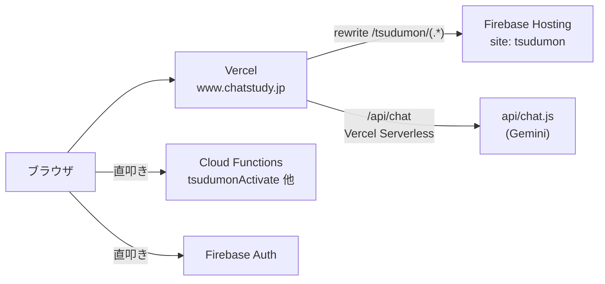
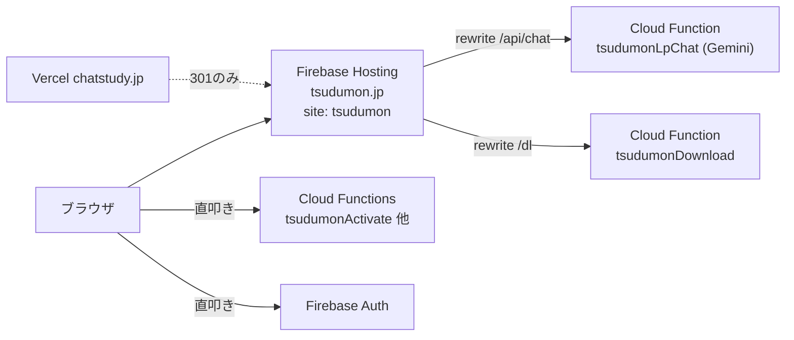

# 設計書

## アーキテクチャ概要

Vercelを配信経路から外し、Firebase Hosting が `tsudumon.jp` を直接受ける構成にする。
Firebase側プロジェクト（`chatstudy-63477`）とCloud Functionsは据え置き。

### 移行前



### 移行後



## URL設計

つづもんは新ドメインの**ルート直下**に配置する（`tsudumon.jp/tsudumon/...` という二重は避ける）。

| 現行 | 移行後 |
|---|---|
| `www.chatstudy.jp/tsudumon/` | `tsudumon.jp/` |
| `www.chatstudy.jp/tsudumon/wb/{NN}/` | `tsudumon.jp/wb/{NN}/` |
| `www.chatstudy.jp/tsudumon/ref/{NN}/` | `tsudumon.jp/ref/{NN}/` |
| `www.chatstudy.jp/tsudumon/map/` | `tsudumon.jp/map/` |
| `www.chatstudy.jp/tsudumon/login/` | `tsudumon.jp/login/` |
| `www.chatstudy.jp/tsudumon/activate/` | `tsudumon.jp/activate/` |
| `www.chatstudy.jp/tsudumon/account/` | `tsudumon.jp/account/` |
| `www.chatstudy.jp/tsudumon/dl` | `tsudumon.jp/dl` |
| `www.chatstudy.jp/welcome`（SPA） | `tsudumon.jp/login/` |
| `www.chatstudy.jp/api/chat`（Vercel関数） | `tsudumon.jp/api/chat`（Cloud Function） |

Firebase Hosting の `public` は現状すでに `public/tsudumon` を指しているため、
**ファイル配置は変わらず、プレフィックスが1階層消えるだけ**。

### 旧URLの救済

chatstudy.jp 側の `vercel.json` で、rewrite（プロキシ）を **redirect（301）** に置き換える。

```
/tsudumon/(.*)  →  https://tsudumon.jp/$1   (permanent)
/tsudumon       →  https://tsudumon.jp/     (permanent)
```

これにより配布済みPDF・印刷QR・過去のLINEメッセージ内リンクが生き続ける。

## コンポーネント設計

### 1. `pdf-workbook/firebase.json`（新規）

**責務**: つづもんの Hosting 設定を pdf-workbook 側で持つ。

**実装の要点**:
- `hosting` のみを定義。`functions` / `firestore` は書かない（marutto-study 側が正本）。
- `site: "tsudumon"`、`public: "dist-web"`。
- **`/dl` の rewrite を修正する。** 現行 `marutto-study/firebase.json` は
  ```json
  { "source": "/dl", "destination": "https://asia-northeast1-.../tsudumonDownload" }
  ```
  と書かれているが、Firebase Hosting の `rewrites.destination` は**ローカルパス専用**で、
  外部URLは指定できない。現状これが動いて見えるのは Vercel 側の
  `/tsudumon/dl → cloudfunctions.net` が先に処理しているためであり、
  **Vercelを外すと `/dl` が壊れる**。正しい書き方に直す:
  ```json
  { "source": "/dl", "function": { "functionId": "tsudumonDownload", "region": "asia-northeast1" } }
  ```
  ※ この挙動は移行前に実機で検証すること（フェーズ0）。
- `/api/chat` も同様に `function` 形式で `tsudumonLpChat` へ向ける。
- `cleanUrls: false`（現行踏襲）、`trailingSlash` 相当の挙動が変わらないか確認する。

### 2. `.firebaserc`（新規）

`{"projects": {"default": "chatstudy-63477"}}`。
プロジェクトIDは chatstudy 由来のままだが、内部識別子であり表には出ないため変更しない
（Firebaseはプロジェクト作成後のID変更を許可していない）。

### 3. Cloud Function `tsudumonLpChat`（新規）

**責務**: LPのAIチャット。`lp/api/chat.js` のVercel版と等価な応答を返す。

**実装の要点**:
- 配置は `marutto-study/functions/src/tsudumonLpChat.ts`（Functionsの正本がここにあるため）。
- 現行は `export default async function handler(req, res)` の Vercel 形式。
  Firebase の `onRequest`（v2, region `asia-northeast1`）へ移植する。
  `req.body` / `res.status().json()` は Express 互換なので**ロジック本体はほぼそのまま流用できる**。
- 環境変数 `GEMINI_API_KEY` / `CHAT_DAILY_LIMIT` / `CHAT_USER_DAILY_LIMIT` を
  Vercel から Firebase Functions 側（`functions/.env`）へ移す。
  **`.env` の値は読み書きしない**（CLAUDE.md規律）。キー名の追加のみ行い、
  値の設定はユーザーが手動で実施する。
- 日次カウンタはインスタンスローカルの目安であり、現行仕様を踏襲する（厳密化はスコープ外）。
- CORSは不要（同一オリジンの Hosting rewrite 経由で呼ばれるため）。

### 4. ホスト名ガードの修正

現行、以下の1行が各ページ先頭に埋め込まれている:

```js
if(location.hostname==='tsudumon.web.app'){
  location.replace('https://www.chatstudy.jp/tsudumon'+location.pathname+location.search+location.hash);
}
```

これは「LINE Login の Callback URL が chatstudy.jp 側で登録されているため、
`tsudumon.web.app` に直接来られるとログインできない」ことへの対処。
移行後は正規ホストが `tsudumon.jp` になるので、向き先を反転させる:

```js
if(location.hostname==='tsudumon.web.app'){
  location.replace('https://tsudumon.jp'+location.pathname+location.search+location.hash);
}
```

**埋め込み箇所（正本）**:

| ファイル | 行 | 生成先 |
|---|---|---|
| `generate_reference_web.py` | 477 | `ref/{NN}/` |
| `generate_workbook_web.py` | 607 | `wb/{NN}/` |
| `generate_tsudumon_portal.py` | 223 | `map/` |
| `lp/index.html` | - | LP |
| `lp/privacy.html` | 5 | プライバシー |
| `lp/tokushoho.html` | 5 | 特商法 |

### 5. `/welcome` 依存の解消

参考書・問題集の生成ページはログイン導線として chatstudy SPA の `/welcome` を使っている。

| ファイル | 行 | 内容 |
|---|---|---|
| `generate_reference_web.py` | 1056 | `<a class="chat-login-btn" href="/welcome">` |
| `generate_reference_web.py` | 1649 | `'/welcome?next=' + encodeURIComponent(...)` |
| `generate_workbook_web.py` | 1204 | `'/welcome?next=' + encodeURIComponent(...)` |

つづもん自前のログインページ `login/index.html` が既に存在し、
`?next=` を受けて OAuth 往復後に戻す実装（75-90行目）を持つため、**これに寄せる**。

- `/welcome` → `/login/` に置換。
- `login/index.html` の `next` 既定値 `'/tsudumon/'` → `'/'` に変更。
- `login/index.html` のオープンリダイレクト防止チェック（「つづもん配下のみ許可」）が
  `/tsudumon/` プレフィックス前提になっていないか確認し、新パス構成に合わせる。

### 6. 出力先の変更

| スクリプト | 変更前 | 変更後 |
|---|---|---|
| `deploy_tsudumon.py`（`TSUDUMON` 定数） | `../marutto-study/public/tsudumon` | `./dist-web` |
| `lp/deploy-to-chatstudy.mjs` | `marutto-study/public/tsudumon` | `../dist-web` |

`lp/deploy-to-chatstudy.mjs` は marutto-study への同期が役目だったため、
`lp/build-lp.mjs` へリネームし、`api/chat.js` のコピー処理を削除する
（チャットはCloud Function化されるため、marutto-study/api への配置が不要になる）。

## データフロー

### LINEログイン（移行後）

```
1. ユーザーが tsudumon.jp/ref/05/ で「LINEでログイン」を押す
2. /login/?next=%2Fref%2F05%2F へ遷移
3. login/index.html が LINE OAuth の認可URLへリダイレクト
   （redirect_uri = https://tsudumon.jp/login/ ← LINE Consoleに登録必須）
4. LINE から code を持って /login/ に戻る
5. createLineCustomToken（Cloud Function・直叩き）でカスタムトークン取得
6. Firebase Auth に signInWithCustomToken
7. next（/ref/05/）へ location.replace
```

### LPチャット（移行後）

```
1. LPのチャットUIが POST /api/chat を叩く（URLは現行のまま）
2. Firebase Hosting の rewrite が Cloud Function tsudumonLpChat へ転送
3. 関数が Gemini を呼び、reply を返す
```

## テスト戦略

### ユニットテスト
- `tsudumonLpChat`: メソッド不正（405）、上限到達時のフォールバック文言、
  リクエストバリデーション（300文字超・messages不正）を検証。
  既存の `functions/src/__tests__/` の書き方に合わせる。

### 統合テスト（実機・フェーズ5）
- 新ドメインでの LINEログイン往復
- `/dl` からのPDFダウンロード
- LP → チャット応答
- ライセンス有効化
- 旧URL（`chatstudy.jp/tsudumon/wb/01/`）からの301追従

### 事前検証（フェーズ0）
- `tsudumon.web.app/dl` を直接叩き、Firebase単体で Function に到達するか確認
  （`destination` に外部URLを書いた現行設定が機能しているかの確認）。

## ディレクトリ構造

```
pdf-workbook/
├── firebase.json           # 新規（hostingのみ）
├── .firebaserc             # 新規
├── dist-web/               # 新規（ビルド成果物・gitignore対象）
│   ├── index.html          # LP
│   ├── wb/{NN}/
│   ├── ref/{NN}/
│   ├── map/
│   ├── login/ activate/ account/
│   ├── _shared/img/
│   └── img/
├── lp/
│   ├── build-lp.mjs        # deploy-to-chatstudy.mjs からリネーム
│   └── api/chat.js         # → functions へ移植後、参照実装として残す
└── deploy_tsudumon.py      # 出力先変更

marutto-study/
├── functions/src/tsudumonLpChat.ts   # 新規
├── api/chat.js                       # 削除
├── public/tsudumon/                  # 削除
└── vercel.json                       # rewrite → redirect(301) に変更
```

**注意**: `login/` `activate/` `account/` `privacy.html` `tokushoho.html` `img/` は
現在 `public/tsudumon/` 直下で**手作業管理**されており、ジェネレータの生成対象外
（`deploy_tsudumon.py` の docstring に明記）。移行時はこれらを
`pdf-workbook/` 配下へ**正本ごと移設**し、以後 git 管理する必要がある。

## 実装の順序

1. **フェーズ0**: 事前検証（`/dl` の挙動、Firebase Hosting のrewrite仕様確認）
2. **フェーズ1**: 手作業管理ファイルの正本を pdf-workbook へ移設
3. **フェーズ2**: 出力先変更＋`firebase.json` 新設（この時点で `tsudumon.web.app` で動作確認可能）
4. **フェーズ3**: ドメイン依存箇所の書き換え（ホスト名ガード・`/welcome`・絶対URL）
5. **フェーズ4**: チャットAPIのCloud Function化
6. **フェーズ5**: DNS・LINE Console・デプロイ（**ユーザー承認後**）
7. **フェーズ6**: chatstudy.jp 側のクリーンアップ（301化・不要ファイル削除）

フェーズ2完了時点で `https://tsudumon.web.app/` が単独で動く状態になるため、
DNS切替前に大半の検証を済ませられる。

## セキュリティ考慮事項

- `login/index.html` のオープンリダイレクト防止（`next` の許可プレフィックス）を
  パス構成変更時に緩めないこと。現行は「つづもん配下のみ許可」。
- `GEMINI_API_KEY` を Functions 側へ移す際、**値をリポジトリにも会話にも出さない**。
- 301リダイレクトはクエリ文字列を保持すること（`?next=` 等が落ちるとログインが壊れる）。

## パフォーマンス考慮事項

- Vercelの1ホップが消えるため、初期表示は改善方向。
- Cloud Function のコールドスタートがLPチャットの初回応答に乗る
  （Vercel関数でも同様の性質があるため、体感差は小さい想定）。

## 将来の拡張性

- 本移行後、`chatstudy-63477` プロジェクトを「つづもん用」に読み替えて運用すれば、
  chatstudy.jp のドメイン・Vercelプロジェクトを（301猶予期間の後）廃止できる。
  ただし `mubista` `typing` が同ドメイン配下にあるため、
  ドメイン廃止にはそれらの移設が別途必要（本件スコープ外）。

## 既存作業との衝突注意

`marutto-study/.steering/20260725-tsudumon-dedicated-line-bot/` が**進行中**で、
`functions/src/lineWebhook.ts` を大規模に改修中（フェーズ2bが未完了）。
本件でも `lineWebhook.ts` の `TSUDUMON_LP_URL`（1156行目）の書き換えが必要なため、
**1行の定数変更に留め、他の差分を持ち込まない**こと。
