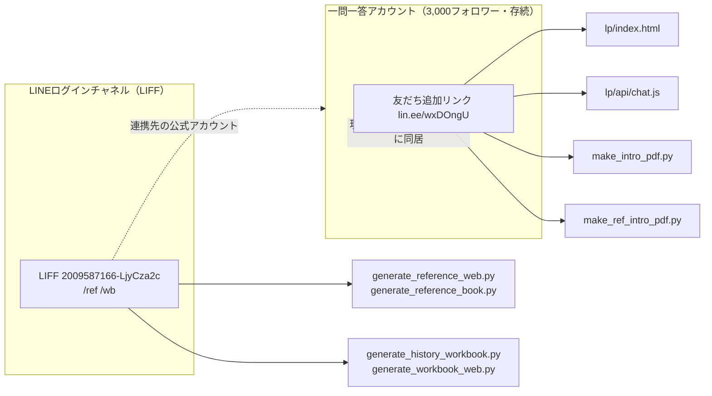

# つづもん 公式LINE分離 移行手順書

作成 2026-07-24。

> 関連設計: `docs/つづもん-登録フロー設計.md`（LINEファースト登録フローの正本）、
> `.steering/20260724-tsudumon-flow-overhaul/`（requirements.md / design.md / tasklist.md —
> ゲート基盤・自動ログイン・3日間無料お試しの実装計画）。
> 本手順書はこの刷新の一部として、**「つづもん専用の公式LINEアカウントへの分離」**だけを
> 切り出して扱う。コード変更・デプロイは本書の対象外（別途、章6・7の作業として実施する）。

---

## 0. ゴールと方針

### なぜ分離するか

- つづもんは月額1,280円のサブスクで、**日次プッシュ（今日の問題配信）が前提**の設計。
- 現状の入口は、無料の一問一答用公式LINE（3,000フォロワー・現役配信中）に間借りしている。
  同居させたまま日次プッシュを始めると、
  - 一問一答の配信と「今日の問題」通知が混線し、無料ユーザーにも配信ノイズが増える
  - 有料層（つづもん課金者）だけを対象にした個別配信・友だち管理ができない
  - 通数プラン（後述）が一問一答の無料配信分と合算され、コスト管理が難しくなる
- そのため、**つづもん専用の新しい公式LINEアカウントを作り、日次プッシュ・決済・教材連結をすべてそちらへ移す**。
- 一問一答アカウントは**そのまま残し、無料配信を継続**する。既存3,000フォロワーは、
  今回の移行時に**つづもんローンチの送客リストとして1回だけ活用**する（章8）。

### 現状の連結図（何が旧アカウントを指しているか）

つづもんの入口は大きく2種類あり、性質が異なる。

| 入口 | 実体 | 差し替えの重さ |
|---|---|---|
| ①友だち追加リンク `https://lin.ee/wxDOngU` | 一問一答アカウントの友だち追加用短縮URL。LP・PDF・チャットのフォールバック文言にハードコード | 軽い（文字列置換のみ、4ファイル） |
| ②LIFF `2009587166-LjyCza2c` | **チャットでスタディの units LIFF そのもの**（つづもん専用ではない）。つづもんのQRは `/wb` `/ref` をパス連結して流用している。参考書19冊・問題集Webの全QR/ボタンが指す先 | **変更しない**（2026-07-25 検証済。理由は章2） |

①を指しているファイル（友だち追加リンクのハードコード箇所）:

| ファイル | 用途 | 該当箇所 |
|---|---|---|
| `lp/index.html` | LPのCTAボタン（「3日間無料でためす」「今日の問題を受け取る」） | href="https://lin.ee/wxDOngU" ×2箇所 |
| `lp/api/chat.js` | AIチャットのフォールバック文面・案内文（Vercel関数） | 文字列中に7箇所（32, 45, 80, 91, 99, 127, 133行目） |
| `make_intro_pdf.py` | 問題集の「はじめにお読みください」PDF生成 | `FRIEND_URL = "https://lin.ee/wxDOngU"`（33行目） |
| `make_ref_intro_pdf.py` | 参考書の「はじめにお読みください」PDF生成 | `FRIEND_URL = "https://lin.ee/wxDOngU"`（25行目） |

②を指している箇所（LIFF ID定数の重複）:

| ファイル | 該当行 | 生成物 | パス |
|---|---|---|---|
| `generate_reference_web.py` | 77行目 `LIFF_ID_UNITS = "2009587166-LjyCza2c"` | 参考書Web版QR | `/ref` |
| `generate_reference_book.py` | 35行目 `LIFF_ID_UNITS = "2009587166-LjyCza2c"` | 参考書PDF内QR | `/ref` |
| `generate_history_workbook.py` | 38行目 `LIFF_ID_UNITS = "2009587166-LjyCza2c"` | 問題集PDF内QR | `/wb` |
| `generate_workbook_web.py` | 90行目 `LIFF_ID_UNITS = "2009587166-LjyCza2c"` | 問題集Web版QR | `/wb` |



### 移行の方針（結論の先出し・2026-07-25 検証で更新）

- **LIFFは一切触らない。** 連携先の付け替えもしない（章2に理由）。
  したがって参考書19冊・問題集の**QR/URLは再生成不要**。
- 成立の根拠は**プロバイダーが同一であること**。LINEのユーザーIDはプロバイダー単位で発行されるため、
  同一プロバイダー配下なら、LIFF（LINEログインチャネル）で取得する userId と
  新しいつづもんBot（Messaging APIチャネル）の webhook が受け取る userId は**同じ値**になる。
  → LIFFを据え置いたまま、新Botから同じユーザーへ push できる。
- 一方、当初の想定（「①友だち追加リンク4ファイルだけ」）は**不足**だった。
  QRを読んだあとの出題が現状「チャットでスタディのトーク」へ push される設計のため、
  追加で次が必要（詳細は章6）:
  - LIFF 2ページ（`LiffWorkbookLaunchPage.tsx` / `LiffReferenceLaunchPage.tsx`）の
    友だち追加URL・トークディープリンクを新アカウントへ
  - Cloud Function `workbookLaunch` / 参考書側の push トークンを `LINE_TSUDUMON_*` へ
  - つづもんBot用の webhook（回答処理・AI先生への質問）をどうするか
- 上記の作業量を決めるため、`docs/つづもん-webhook棚卸し.md` で現行 webhook のハンドラを
  「つづもん専用 / 一問一答専用 / 共通」に分類する棚卸しを行う。

---

## 1. 新公式アカウント作成とMessaging APIチャネル作成

### 1-1. LINE Official Account Manager で新アカウントを作る

- [ ] https://manager.line.biz/ にログイン（一問一答アカウントと同じLINEビジネスIDで可）
- [ ] 「アカウントリスト」→「新規アカウント作成」で「つづもん」用の公式アカウントを新規作成
- [ ] アカウント名・アイコン・あいさつメッセージを「つづもん」ブランドで設定
- [ ] **プロバイダーは一問一答アカウントと同一プロバイダーを選択する**（章2のLIFF連携先付け替えの前提条件になるため必須）

### 1-2. LINE Developers でMessaging APIチャネルを有効化

- [ ] https://developers.line.biz/console/ を開く
- [ ] 1-1で作った公式アカウントに対応するプロバイダーを選択（同一プロバイダーであることを確認）
- [ ] 「Messaging API」チャネルが自動生成されていることを確認、なければチャネル作成
- [ ] チャネルシークレット・チャネルアクセストークン（長期）を発行し、安全な場所に控える
  （既存の一問一答用トークンとは別に管理し、コード側の環境変数キー名を変えて衝突を防ぐ）

### 1-3. 通数プランと日次プッシュのコスト試算

つづもんの日次プッシュは「全フォロワーへの一斉配信」ではなく、**課金者（アクティブなサブスク契約者）への個別push**で行う。
LINE公式アカウントの無料/ライト/スタンダードプランは月間の**無料メッセージ通数**に上限があり、
超過分は従量課金となる。日次プッシュの通数は概ね次式で見積もる。

```
月間必要通数 ≒ 課金者数 × 配信日数（約30日）
```

| 課金者数 | 月間必要通数（目安） | 想定プラン |
|---|---|---|
| 100人 | 約3,000通/月 | フリー枠超過分は従量、または「ライト」 |
| 500人 | 約15,000通/月 | 「スタンダード」相当を検討 |
| 1,000人 | 約30,000通/月 | 「スタンダード」〜従量を試算し比較 |

- [ ] 現行の料金体系・無料通数枠・従量単価は変動するため、**契約前に必ず公式サイトの最新料金ページで再確認する**
- [ ] 想定課金者数のレンジ（現実的な下限〜目標値）で月額コストを試算し、サブスク単価1,280円に対する採算ラインを確認する
- [ ] **全フォロワー一斉配信（無料アカウントの「メッセージ配信」機能）は使わない**方針をここで明記・合意しておく
  （課金者以外に配信すると通数を浪費し、無料ユーザーへのノイズにもなるため。個別push APIで課金者IDのみへ送る）

---

## 2. LIFFは触らない（結論：付け替え不要・付け替え禁止）

> 当初この章は「LIFFの連携先を新アカウントへ付け替える」計画だった。
> 2026-07-25 にコードを検証した結果、**付け替えは不要であり、かつ実行してはならない**と判明したため書き換えた。

### 検証で分かったこと

**(1) `2009587166-LjyCza2c` はつづもん専用のLIFFではない。**
これはチャットでスタディの **units LIFF そのもの**（endpoint `https://line.chatstudy.jp/liff/units`）で、
つづもんのQRは `/wb` `/ref` をパス連結して**流用**している。

> `marutto-study/src/pages/LiffWorkbookLaunchPage.tsx:4-6`
> 「印刷ワークの QR は `https://liff.line.me/{VITE_LIFF_ID_UNITS}/wb?t=単元名` を指す。
> LIFF は units の endpoint（/liff/units）にパスを連結してこのページを開くので、
> units の LIFF アプリをそのまま流用でき、LINE Developers Console での追加登録は不要。」

**(2) 同じLINEログインチャネル `2009587166` に、チャットでスタディのLIFFが全部同居している。**
`settings` / `report` / `premium-apply` / `contact` / `help` / `nickname` など
（例: `src/pages/LiffSettingsPage.tsx:84` の `2009587166-IvJl78Hk`）。
→ このチャネルの「リンクされたLINE公式アカウント」を付け替えると、
**チャットでスタディ側のLIFF全部を巻き込む**（友だち追加プロンプトの向き先などが新アカに変わる）。

**(3) 付け替えなくても目的は達成できる。**
LINEのユーザーIDは**プロバイダー単位**で発行される（LINE Developers 公式ドキュメント）。
章1で新アカウントを**同一プロバイダー**に作ったため、LIFFで取得する userId と
つづもんBotの webhook が受け取る userId は同一値になる。
→ LIFFを据え置いたまま、新Botから同じユーザーへ push できる。

### 決定事項

- [x] LIFF `2009587166-LjyCza2c` は**変更しない**
- [x] LINEログインチャネルの「リンクされたLINE公式アカウント」は**変更しない**
- [x] 4ジェネレータの `LIFF_ID_UNITS` 定数は**変更しない**
  （`generate_reference_web.py:77` / `generate_reference_book.py:35` /
  `generate_history_workbook.py:38` / `generate_workbook_web.py:90`）
- [x] 参考書19冊・問題集PDF・Web版の**QR再生成は不要**。配布済みPDFの旧QRも有効なまま

### 残る確認（実機テスト、章9で実施）

- [ ] 新アカウントを友だち追加した状態で、参考書・問題集のQRを実機で読み取り、
      LIFFが起動し、意図した**新アカウントのトーク**へ遷移すること
      （※この遷移先はLIFFの設定ではなくコード側のハードコードで決まる。章6で変更する）
- [ ] LIFF内のログインセッションが新旧どちらのアカウントでも維持されること

---

## 3. Webhook・チャネルトークン・応答設定を新アカへ

- [ ] 新Messaging APIチャネルのWebhook URLに、現行のつづもん用エンドポイント
      （AI採点・質問応答・今日の問題配信を処理しているサーバー/関数の向き先）を設定
- [ ] チャネルアクセストークンを新アカウントのものに切り替え（環境変数・シークレット管理箇所を確認し、
      新旧を区別できるキー名にする。実際の書き換えは章6の対象外＝別途コード修正作業として扱う）
- [ ] Webhookの応答設定で「あいさつメッセージ」「自動応答メッセージ」を無効化し、Messaging APIからの応答のみにする
      （一問一答アカウントの設定を踏襲）
- [ ] **旧アカウント（一問一答用）のWebhook・応答設定はそのまま温存**し、一問一答の配信に影響が出ないことを確認

---

## 4. リッチメニュー新設

新アカウント用に、つづもん専用のリッチメニューを新規作成する。

- [ ] 「今日の問題」（当日分の問題へのショートカット、章2のLIFF `/wb` 経由）
- [ ] 「学習記録」（進捗・理解度チェックの確認、LIFF `/ref` または専用画面）
- [ ] 「質問する」（AI先生への質問、LIFF経由のチャット起動）
- [ ] 友だち追加直後のデフォルト表示として設定し、実機（LINEアプリ）で表示崩れがないか確認
- [ ] 一問一答アカウント側のリッチメニューは変更しない

---

## 5. 決済後の有効化フローを新アカに紐付け

- [ ] 現行の「決済確認→教材アンロック（`activateTsudumonLicense`等、`tsudumon`フィールドの付与）」フローが、
      どのLINEアカウントのユーザーID（`uid`／LINEログインのプロフィール）を基準に動いているか確認
- [ ] 章2でLIFF連携先を新アカウントへ付け替えた場合、LINEログインで取得されるユーザーIDの体系が
      変わらないか（同一プロバイダー内の同一LINEログインチャネルなら通常は影響しない想定だが要確認）
- [ ] 決済完了メール・サンクスページの案内文言に「新アカウントを友だち追加してください」の導線を追加
      （既存ユーザー・新規購入者の両方が新アカウント経由でアンロック操作をする状態にする）
- [ ] 一問一答アカウント経由では決済・アンロックが発生しない（発生させない）ことを確認

---

## 6. コード差し替え（友だち追加リンクのみ）

章2でLIFF連携先の付け替えが成功する前提であれば、コードで直すのは**①友だち追加リンクのみ**。
②のLIFF ID定数4箇所（章0の表）は**無変更**でよい。

| ファイル | 変更内容 |
|---|---|
| `lp/index.html` | `https://lin.ee/wxDOngU` → 新アカウントの友だち追加リンクに置換（2箇所） |
| `lp/api/chat.js` | 文中の `https://lin.ee/wxDOngU` を新リンクに置換（7箇所） |
| `make_intro_pdf.py` | `FRIEND_URL = "https://lin.ee/wxDOngU"`（33行目）を新リンクに変更 |
| `make_ref_intro_pdf.py` | `FRIEND_URL = "https://lin.ee/wxDOngU"`（25行目）を新リンクに変更 |

- [ ] 新アカウントの友だち追加リンク（LINE Official Account Managerの「あいさつ・友だち追加」設定から
      短縮URL `lin.ee/xxxx` を発行）を取得
- [ ] 上記4ファイルを新リンクに置換
- [ ] 置換漏れがないか、リポジトリ全体で `lin.ee/wxDOngU` を再検索して確認

### 任意ステップ: リンクの1箇所集約（将来の再切替を楽にする提案）

将来また公式アカウントを切り替える事態に備え、余力があれば次の整理を検討する（今回の移行の必須要件ではない）。

- [ ] 友だち追加リンクを環境変数・設定ファイル1箇所（例: `lp`のビルド設定や共通定数モジュール）に集約し、
      4ファイルがそこを参照する形にリファクタリングする
- [ ] 同様に、LIFF IDについても4ジェネレータが共通の設定ファイル/環境変数を参照する形にできないか検討する
      （今回は据え置きのため不要だが、次回の分離作業を軽くする）

---

## 7. 再生成・デプロイ

コード差し替え（章6）を実施した後の反映手順。**本手順書自体はデプロイを実行しない**（作業時のチェックリストとして記載）。

| 対象 | コマンド | 備考 |
|---|---|---|
| LP（`lp/index.html`） | `node lp/deploy-to-chatstudy.mjs` → `firebase deploy --only hosting:tsudumon --project chatstudy-63477` | 友だちリンクの反映 |
| 教材（問題集/参考書/マップ） | `python -X utf8 deploy_tsudumon.py` → 同上 `firebase deploy` | 章2の付け替えが成功していれば**再生成不要**なので、このデプロイ自体スキップ可。章2が代替手順（新LIFF）に倒れた場合のみ、全教材再生成→本コマンドでデプロイ |
| `lp/api/chat.js` | marutto-study リポジトリへ **git push**（www再ビルド） | Vercel関数のため、firebase deployの対象外。pushでVercelが自動反映 |

- [ ] LPデプロイ後、本番URLで友だち追加ボタンのリンク先が新アカウントになっているか確認
- [ ] chat.js デプロイ後、AIチャットのフォールバック文言（上限到達時等）が新リンクを案内するか確認
- [ ] （代替手順に倒れた場合のみ）再生成した教材のQRを実機でスキャンし、新LIFFへ遷移することを確認

---

## 8. 3,000人への告知配信

一問一答アカウントから**1通のみ**、新アカウントへの案内を配信する。売り込み過多にならない文面とし、
無料体験導線を添える。

### 配信文面案（1通・叩き台）

```
いつも「一問一答」をご利用いただきありがとうございます。

このたび、定期テスト対策の問題集・参考書アプリ「つづもん」を、
専用の公式LINEアカウントとしてスタートしました。

AIの先生に質問できたり、今日解く問題を毎日届けたり、
一問一答とはひと味ちがう使い方ができます。

まずは3日間、全単元を無料でお試しいただけます。
気になる方はこちらから友だち追加してみてください👇
[新アカウント友だち追加リンク]

※このアカウント（一問一答）は今まで通り無料で続けます。
　今回のご案内は今回限りです。
```

- [ ] 文面を最終確認（誇大表現・強い売り込み口調がないか）
- [ ] 一問一答アカウントの配信機能から、上記1通のみを送信（連投しない）
- [ ] 配信後の友だち追加数・体験開始数を記録し、送客効果を把握する

---

## 9. 移行後チェックリスト・ロールバック方針

### 実機確認チェックリスト

- [ ] 新アカウントを友だち追加できる（リンク・QRとも）
- [ ] 友だち追加直後にリッチメニュー（今日の問題／学習記録／質問する）が表示される
- [ ] 決済導線から購入→新アカウント経由で教材アンロックが完了する
- [ ] LIFF経由で参考書・問題集を開き、AI質問ができる
- [ ] LIFF経由で理解度チェック・即出題が動作する
- [ ] 「今日の問題」の日次プッシュが新アカウントから届く（課金者アカウントで実機受信確認）
- [ ] 一問一答アカウント側の配信・応答が従来通り動作している（影響がないことの確認）

### ロールバック方針

- [ ] 章2でLIFF連携先を付け替えた場合、問題発生時は連携先を一問一答アカウントへ戻せるか事前に確認しておく
      （戻せない設計だった場合、ロールバックは「新アカウントの設定を修正して前進する」一択になる点に留意）
- [ ] 章6のコード差し替えはgit管理下のため、問題があれば当該コミットをrevertし旧リンクに即時復帰可能
- [ ] Webhook・チャネルトークンの切替は、旧アカウント側の設定を温存しているため、
      新アカウント側だけを無効化すれば一問一答の運用には影響しない設計にしておく

---

## 10. 未確認事項・リスク一覧

| # | 項目 | 内容 | 影響度 |
|---|---|---|---|
| 1 | **LIFF連携先の付け替え可否** | 稼働中LIFFの連携公式アカウントをコンソール上で変更できるかが未確認。プロバイダー/チャネル構成次第で不可の可能性あり。不可の場合は章2代替手順（新LIFF作成＋4ジェネレータ更新＋全教材再生成）が必要になり、作業量が大きく増える | 高 |
| 2 | **決済連携の紐付け** | 決済確認→教材アンロックのフローが依存しているユーザーID体系（LINEログインのuid等）が、アカウント分離・LIFF連携先変更で影響を受けないか未検証 | 高 |
| 3 | **通数超過コスト** | 課金者数の伸び方次第で、想定プランの無料通数を超過し従量課金が発生する可能性。最新の料金体系を都度確認する必要あり | 中 |
| 4 | 新アカウントのLINEログインチャネルとMessaging APIチャネルの紐付け設定 | 同一プロバイダー内での構成が、既存の一問一答チャネルと干渉しないか | 中 |
| 5 | 旧アカウントに残る過去のトーク履歴・友だちからの問い合わせ | 分離後、つづもんに関する問い合わせが誤って一問一答アカウントに届いた場合の案内フロー | 低 |
| 6 | 印刷済み・配布済みの旧QR（代替手順に倒れた場合） | 新LIFFへ切り替えた場合、既に印刷・配布済みの参考書・問題集のQRが無効になる。回収困難な媒体がないか確認 | 中（代替手順時のみ） |
